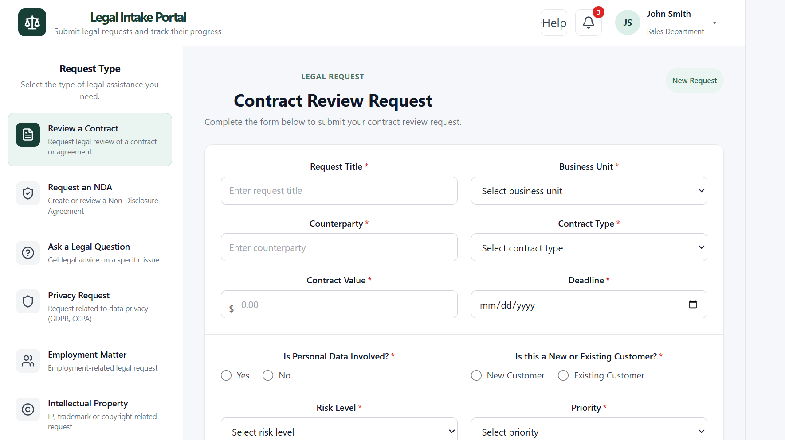
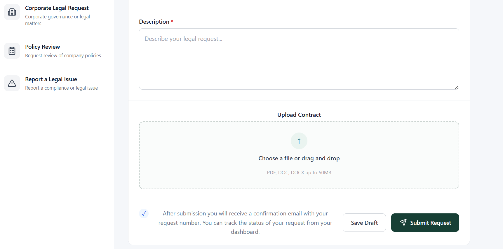

# Legal Intake Portal

A responsive full-stack Legal Intake Portal built with **React, TypeScript, Node.js, Express, and MySQL** as part of a React Developer technical assessment.

The application provides a structured interface for submitting legal requests, with a dedicated Contract Review workflow, reusable React components, client-side validation, file upload handling, draft saving, submission confirmation, loading states, responsive navigation, accessibility considerations, automated tests, backend API integration, MySQL persistence, and Dockerized deployment.

## Features

### Legal Request Navigation

* Contract Review
* Legal Research
* Compliance
* Other
* Interactive request-type navigation
* Keyboard-accessible navigation
* Responsive mobile sidebar

### Contract Review Request Form

The Contract Review workflow includes:

* Request title
* Business unit
* Counterparty
* Contract type
* Contract value
* Required-by date
* Personal data involvement
* Customer type
* Risk level
* Priority
* Request description
* Character counter
* Supporting document upload
* Save Draft
* Submit Request

### Form Validation

The application provides client-side validation for:

* Required fields
* Email format where applicable
* Required-by date
* Past dates
* Minimum description length
* Supported file types
* Maximum file size

Supported document types:

* PDF
* DOC
* DOCX

The frontend validates uploaded documents before submission, while the backend also validates uploaded files using Multer.

### Submission Experience

The submission workflow includes:

1. Form completion
2. Client-side validation
3. Confirmation dialog
4. Review or cancel option
5. Loading state
6. API submission
7. Backend processing
8. Database persistence
9. Success feedback

### Draft Saving

Users can save incomplete requests as drafts.

Draft data is maintained on the client side using browser `localStorage`, allowing users to preserve incomplete form information before submitting a request.

### File Upload Handling

The application supports document uploads as part of the Contract Review workflow.

The backend uses **Multer** to process uploaded files and stores them in a persistent Docker volume.

Supported formats:

* PDF
* DOC
* DOCX

The backend stores file metadata together with the legal request, including:

* Original filename
* Stored filename
* File path
* MIME type
* File size

### Backend API

The application includes a Node.js and Express backend that provides API endpoints for legal requests.

Main endpoints include:

```text
GET    /api/health
GET    /api/legal-requests
GET    /api/legal-requests/:id
POST   /api/legal-requests
```

The health endpoint can be used to verify that the backend is running:

```text
http://localhost:8000/api/health
```

### MySQL Database

The backend uses **MySQL 8.4** for persistent storage.

The database is named:

```text
legal_intake
```

The database contains a `legal_requests` table for storing submitted legal requests and associated uploaded-file metadata.

The database schema is initialized automatically using:

```text
database/init.sql
```

### Dockerized Application

The complete application is containerized using **Docker and Docker Compose**.

The Docker environment contains four services:

```text
Frontend
Backend
MySQL
phpMyAdmin
```

The frontend is served through **Nginx**, which also proxies API requests to the backend.

The architecture is:

```text
Browser
   |
   v
Nginx / React Frontend
   |
   v
Node.js / Express Backend
   |
   v
MySQL Database
```

Uploaded documents and MySQL data are stored using persistent Docker volumes.

## Application URLs

When running the application with Docker Compose:

### Frontend

```text
http://localhost/
```

### Backend Health Check

```text
http://localhost:8000/api/health
```

### MySQL

The MySQL container is exposed locally on:

```text
localhost:3307
```

### phpMyAdmin

phpMyAdmin is available at:

```text
http://localhost:8080/
```

phpMyAdmin connects to the MySQL service inside the Docker Compose network.

## Technology Stack

### Frontend

* React
* TypeScript
* Vite
* CSS
* Lucide React
* Vitest
* React Testing Library
* Testing Library User Event
* Jest DOM

### Backend

* Node.js
* Express
* TypeScript
* Multer
* MySQL2
* CORS
* dotenv

### Database

* MySQL 8.4

### Deployment and Infrastructure

* Docker
* Docker Compose
* Nginx
* phpMyAdmin

## Project Structure

```text
legal-intake-portal/
│
├── frontend/
│   ├── src/
│   │   ├── components/
│   │   │   ├── ConfirmationDialog.tsx
│   │   │   ├── FeedbackMessage.tsx
│   │   │   │
│   │   │   ├── Header/
│   │   │   │   └── Header.tsx
│   │   │   │
│   │   │   ├── RequestTypeSidebar/
│   │   │   │   ├── RequestTypeCard.tsx
│   │   │   │   └── RequestTypeSidebar.tsx
│   │   │   │
│   │   │   └── forms/
│   │   │       ├── ContractReviewForm.tsx
│   │   │       ├── ContractReviewForm.test.tsx
│   │   │       ├── FileUpload.tsx
│   │   │       ├── FormActions.tsx
│   │   │       ├── FormInput.tsx
│   │   │       ├── FormSelect.tsx
│   │   │       ├── RadioGroup.tsx
│   │   │       └── TextArea.tsx
│   │   │
│   │   ├── pages/
│   │   │   ├── LegalIntakePage.tsx
│   │   │   └── LegalIntakePage.test.tsx
│   │   │
│   │   ├── services/
│   │   │   └── legalRequestService.ts
│   │   │
│   │   ├── test/
│   │   │   └── setup.ts
│   │   │
│   │   ├── types/
│   │   │   └── legalRequest.ts
│   │   │
│   │   ├── App.tsx
│   │   ├── App.css
│   │   └── main.tsx
│   │
│   ├── nginx/
│   │   └── nginx.conf
│   │
│   ├── Dockerfile
│   ├── package.json
│   └── vite.config.ts
│
├── backend/
│   ├── src/
│   │   ├── config/
│   │   │   └── database.ts
│   │   │
│   │   ├── controllers/
│   │   │   └── legalRequestController.ts
│   │   │
│   │   ├── middleware/
│   │   │   └── upload.ts
│   │   │
│   │   ├── models/
│   │   │   └── legalRequestModel.ts
│   │   │
│   │   ├── routes/
│   │   │   └── legalRequestRoutes.ts
│   │   │
│   │   └── server.ts
│   │
│   ├── Dockerfile
│   ├── package.json
│   ├── tsconfig.json
│   └── .env.example
│
├── database/
│   └── init.sql
│
├── screenshot-1.png
├── screenshot-2.png
├── docker-compose.yml
├── .gitignore
└── README.md
```

## Getting Started

There are two ways to run the application:

1. Local development
2. Docker Compose

For evaluating the complete full-stack application, **Docker Compose is recommended**.

## Local Development

### Prerequisites

Make sure the following are installed:

* Node.js
* npm
* Git
* MySQL

### Clone the Repository

```bash
git clone https://github.com/shemseshukre/legal-intake-portal.git
cd legal-intake-portal
```

### Frontend Installation

Navigate to the frontend:

```bash
cd frontend
```

Install dependencies:

```bash
npm install
```

Start the Vite development server:

```bash
npm run dev
```

The development frontend normally runs at:

```text
http://localhost:5173/
```

### Backend Installation

Open another terminal and navigate to the backend:

```bash
cd backend
```

Install dependencies:

```bash
npm install
```

Create a local `.env` file based on `.env.example`.

Then start the backend:

```bash
npm run dev
```

The backend normally runs at:

```text
http://localhost:8000
```

## Running with Docker

Docker Compose is the recommended way to run the complete full-stack application.

From the project root:

```bash
docker compose up -d
```

Check the running containers:

```bash
docker compose ps
```

The expected services are:

```text
legal-intake-frontend
legal-intake-backend
legal-intake-mysql
legal-intake-phpmyadmin
```

Open the application:

```text
http://localhost/
```

Open phpMyAdmin:

```text
http://localhost:8080/
```

Stop the application:

```bash
docker compose down
```

The MySQL database and uploaded files are stored in persistent Docker volumes.

## Running Tests

The frontend uses **Vitest** and **React Testing Library**.

Run the test suite:

```bash
cd frontend
npm test -- --run
```

The tests cover important workflows including:

* Form validation
* Successful submission
* Draft saving
* Valid file upload
* Invalid file type
* Oversized file
* File removal
* Confirmation dialog
* Confirmation cancellation
* Character counter
* Submission loading state
* Request-type navigation

For interactive watch mode:

```bash
npm test
```

## TypeScript Validation

### Frontend

From the `frontend` directory:

```bash
npx tsc --noEmit
```

### Backend

From the `backend` directory:

```bash
npm run build
```

The backend TypeScript source is compiled into the `dist/` directory.

## Production Build

### Frontend

From the `frontend` directory:

```bash
npm run build
```

The production build is generated in:

```text
frontend/dist/
```

### Backend

From the `backend` directory:

```bash
npm run build
```

The compiled backend is generated in:

```text
backend/dist/
```

## Application Workflow

The main Contract Review workflow is:

```text
Select Contract Review
        ↓
Complete Request Form
        ↓
Client-side Validation
        ↓
Submit Request
        ↓
Confirmation Dialog
        ↓
Confirm Submission
        ↓
Loading State
        ↓
Frontend API Request
        ↓
Express Backend
        ↓
MySQL Database
        ↓
Request Submitted
        ↓
Success Feedback
```

Users can also select **Save Draft** to save incomplete form information.

## Data Persistence

The application uses different persistence mechanisms for different types of data.

### Draft Data

Draft form information is stored in browser `localStorage`.

Storage key:

```text
legal-intake-drafts
```

### Submitted Requests

Submitted requests are sent to the Express backend and persisted in MySQL.

### Uploaded Documents

Uploaded documents are processed by Multer and stored in the backend's uploads directory.

Docker uses a persistent volume:

```text
uploads_data
```

This allows uploaded files to remain available when the backend container is restarted.

### Database

MySQL data is stored using the Docker volume:

```text
mysql_data
```

## Design and Component Approach

The frontend uses reusable React components rather than placing the entire interface inside a single component.

Examples include:

* `Header`
* `RequestTypeSidebar`
* `RequestTypeCard`
* `FormInput`
* `FormSelect`
* `RadioGroup`
* `TextArea`
* `FileUpload`
* `FormActions`
* `FeedbackMessage`
* `ConfirmationDialog`

The backend follows a structured architecture separating:

* Routes
* Controllers
* Models
* Middleware
* Database configuration

This structure improves maintainability and makes it easier to add additional legal request types and API functionality.

## Accessibility

The application includes accessibility considerations such as:

* Semantic HTML
* Associated form labels
* Keyboard navigation
* ARIA attributes
* Accessible button names
* Focus management
* Accessible validation messages
* Dialog semantics
* Escape-key dialog handling
* Loading-state accessibility

## Security and Validation Considerations

The application includes validation at multiple layers.

### Frontend

The frontend validates:

* Required fields
* Input formats
* Dates
* Description length
* File type
* File size

### Backend

The backend processes uploaded files using Multer and persists legal request data through the MySQL data layer.

For a production deployment, additional security measures would be recommended, including:

* Authentication
* Authorization
* Role-based access control
* Stronger server-side validation
* Rate limiting
* Secure file scanning
* Restricted CORS configuration
* HTTPS
* Secure secret management

## Docker Architecture

The Docker Compose environment consists of four services:

```text
┌─────────────────────────────┐
│        Web Browser          │
└──────────────┬──────────────┘
               │
               │ HTTP :80
               ▼
┌─────────────────────────────┐
│       Nginx / Frontend      │
│      React Application      │
└──────────────┬──────────────┘
               │
               │ /api
               ▼
┌─────────────────────────────┐
│    Node.js / Express API    │
│          Port 8000          │
└──────────────┬──────────────┘
               │
               ▼
┌─────────────────────────────┐
│         MySQL 8.4           │
│        legal_intake         │
└─────────────────────────────┘

┌─────────────────────────────┐
│          phpMyAdmin         │
│          Port 8080          │
└──────────────┬──────────────┘
               │
               ▼
          MySQL 8.4
```

## Future Improvements

If the application were extended into a production system, possible improvements would include:

* Authentication and authorization
* Role-based access control
* User profile management
* Submitted-request history
* Draft editing and deletion
* Request status tracking
* Legal-team assignment
* Real notification system
* Email notifications
* Advanced server-side validation
* Secure document storage
* Virus and malware scanning for uploaded documents
* Audit logging
* Rate limiting
* HTTPS
* Production secret management
* End-to-end browser testing
* Additional request-specific forms

## Assessment Notes

This project was developed as a practical React and TypeScript technical assessment with emphasis on:

* Functional UI
* Component reusability
* Type safety
* Form handling
* Validation
* Accessibility
* Responsive design
* User interaction
* Automated testing
* Maintainable project structure
* REST API integration
* Database persistence
* File upload handling
* Docker containerization

The project was subsequently extended into a full-stack application with a Node.js/Express backend, MySQL database, persistent file storage, Nginx reverse proxy, and Docker Compose orchestration.

## Screenshots

### Legal Intake Portal
### Contract Review Form




## Author

Developed by **Shemse Shukre** as part of a React Developer technical assessment.

## Repository

GitHub:

https://github.com/shemseshukre/legal-intake-portal
